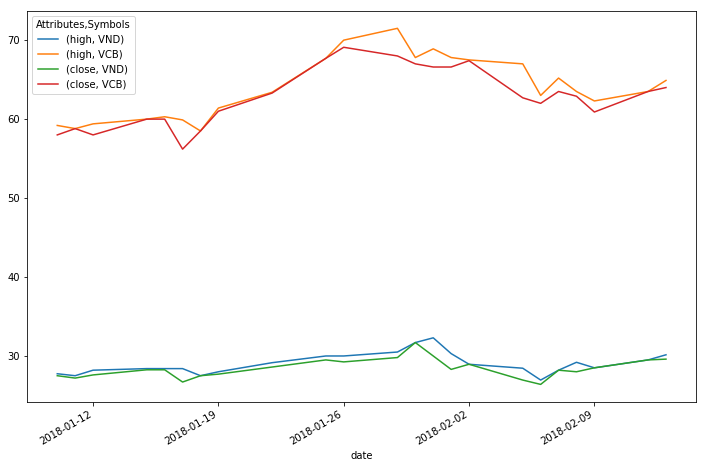
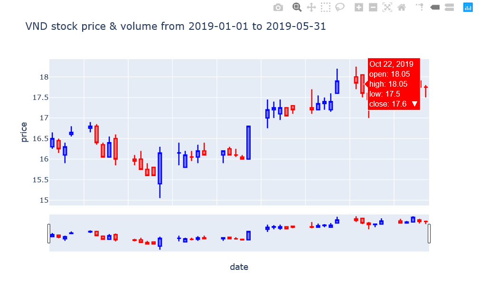

# vnquant package



## 0. NOTE
Note: Currently, prices on VnDirect source are supported again. There are two options data source for you:

* cafef: Set data_source='CAFE'
* vndirect: set data_source='VND'

## 1. Introduction
This project provide the financial information and useful visualization instrument about Vietnam stock market to researcher. Particularly, there are many aspect of data relating to any stock being able to store and clone. The official version are built on both machine learning language Python and R.
## 2. Setting:
This project is in developing process, So it is only distributed on github channel. To install requiring you open the command line and type the below commands:
```
git clone https://github.com/phamdinhkhanh/vnquant
cd vnquant
python setup.py install
```
you must install git command line in your computer to run above command.

## 3. Visualization: (0.0.2)
from version 0.0.2 vnquant enable to you visualize stock price from any symbols code at source cafe or vnd or pandas data frame which have OHLC type. OHLC type meaning that your data frame columns is enough ['open', 'high', 'low', 'close'] list.
Below is general syntax of visualization function supported on vnquant package.

```{python}
from vnquant import Plot
Plot._vnquant_candle_stick(data,
                          title=None,
                          xlab='Date', ylab='Price',
                          start_date=None, end_date=None,
                          colors=['blue', 'red'],
                          width=800, height=600,
                          show_vol=True,
                          data_source='cafe', # not support vnd
                          **kargs)
```

**Arguments**
* `data`: is pandas data frame of OHLC type or OHLCV type, or string symbol of any VietNam stock index.
in case symbol, data is automatically cloned from open source.
* `title`: General title of candle stick chart. In case data is symbol, title going to be default according to cloned data.
* `xlab`: x label. Default Date.
* `ylab`: y label. Default Price.
* `start_date`: start date. Default None. Must to be declared when data is symbol.
* `end_date`: end date. Default None. Must to be declared when data is symbol.
* `colors`: list colors defines increasing and decreasing color stick candle in order.
* `width`: with of plot frame. Default 800px
* `height`: height of plot frame. Default 600px
* `show_vol`: is show volume of stock price?
* `data_source`: invalid when use symbol intead of data frame. Source to clone data, 'VND' or 'CAFE'.

### 3.1. Visualization from source VND or CAFE

In this way, you can visualize stock price clone from VND or CAFE source by pass symbol, start_date, end_date into module as below:
```{python}
from vnquant import Plot
Plot._vnquant_candle_stick(data='VND',
                           title='VND stock price data and volume from 2019-09-01 to 2019-11-01',
                           xlab='Date', ylab='Price',
                           start_date='2019-09-01',
                           end_date='2019-11-01',
                           show_vol=True)
```


You can suppress volume by set up show_vol=False. Result as below:



### 3.2. Visualization from data frame
Data frame must be OHLC or OHLCV type. OHLC type when it includes ['open','high','low','close'] and OHLCV is ['open','high','low','close','volume']. In case your data frame have columns with the same function, you should accordingly rename its.

```{python}
from vnquant import Plot
Plot._vnquant_candle_stick(data = data_vnd,
                      title='Your data',
                      ylab='Date', xlab='Price',
                      show_vol=True)
```


To check whether data_vnd frame is OHLC or OHLCV type you can try:

```{python}
from vnquant import utils
print(utils._isOHLC(data_vnd))
print(utils._isOHLCV(data_vnd))
```

Return `True` mean data frame is adapted types.

## 4. Clone Stock Prices: (0.0.1)
You can load the prices of one or more stocks in specific time interval according to syntax as below.
```{python}
from vnquant.DataLoader import DataLoader

DataLoader(symbols="VND",
           start="2018-01-10",
           end="2018-02-15",
           minimal=True,
           data_source="cafe")
```
**Arguments**

* `symbols`: a string or list of strings indicate the stock names. The stock symbols in regular include 3 upper case letters except several special index such as: `VN30INDEX, VN100-INDEX, HNX-INDEX, HNX30-INDEX, UPCOM-INDEX` in case your `data_source = "cafe"` and `VN30, HNX30, UPCOM` in case your `data_source = "vnd"`.
* `start`: start date time with format `yyyy-mm-dd`.
* `end`: end date time with format `yyyy-mm-dd`.
* `minimal`: default is True, we only clone `high, low, open, close, adjust price, volume` of stocks. In contrast, more information is added,
for example `volumn_reconcile, volumn_match,...`
* `data_source`: the source to clone the stock prices. Currently, there two main resources are `Vndirect` and `Cafef` showed by `data_source = vnd` and `cafe`, respectively. The default is `vnd`.

### 4.1. Clone one stock:
```{python}
import vnquant.DataLoader as web
loader = web.DataLoader('VND', '2018-02-02','2018-04-02')
data = loader.download()
data.head()
```
<table border="1" class="dataframe">
  <thead>
    <tr>
      <th>Attributes</th>
      <th>high</th>
      <th>low</th>
      <th>open</th>
      <th>close</th>
      <th>avg</th>
      <th>volume</th>
    </tr>
    <tr>
      <th>Symbols</th>
      <th>VND</th>
      <th>VND</th>
      <th>VND</th>
      <th>VND</th>
      <th>VND</th>
      <th>VND</th>
    </tr>
    <tr>
      <th>date</th>
      <th></th>
      <th></th>
      <th></th>
      <th></th>
      <th></th>
      <th></th>
    </tr>
  </thead>
  <tbody>
    <tr>
      <th>2018-02-02</th>
      <td>28.95</td>
      <td>27.60</td>
      <td>28.5</td>
      <td>28.95</td>
      <td>28.28</td>
      <td>1700670.0</td>
    </tr>
    <tr>
      <th>2018-02-05</th>
      <td>28.45</td>
      <td>26.95</td>
      <td>28.1</td>
      <td>26.95</td>
      <td>27.68</td>
      <td>2150120.0</td>
    </tr>
    <tr>
      <th>2018-02-06</th>
      <td>26.95</td>
      <td>25.10</td>
      <td>25.1</td>
      <td>26.40</td>
      <td>25.25</td>
      <td>3129690.0</td>
    </tr>
    <tr>
      <th>2018-02-07</th>
      <td>28.20</td>
      <td>27.50</td>
      <td>27.5</td>
      <td>28.20</td>
      <td>27.99</td>
      <td>1985120.0</td>
    </tr>
    <tr>
      <th>2018-02-08</th>
      <td>29.20</td>
      <td>27.70</td>
      <td>28.0</td>
      <td>28.00</td>
      <td>28.47</td>
      <td>943260.0</td>
    </tr>
  </tbody>
</table>

### 4.2. Clone more stocks:
We need to set up symbols as a list.
```{python}
loader = web.DataLoader(symbols=["VND", "VCB"], start="2018-01-10", end="2018-02-15", minimal=True, data_source="cafe")
data = loader.download()
data.head()
```
<table border="1" class="dataframe">
  <thead>
    <tr>
      <th>Attributes</th>
      <th colspan="2" halign="left">high</th>
      <th colspan="2" halign="left">low</th>
      <th colspan="2" halign="left">open</th>
      <th colspan="2" halign="left">close</th>
      <th colspan="2" halign="left">avg</th>
      <th colspan="2" halign="left">volume</th>
    </tr>
    <tr>
      <th>Symbols</th>
      <th>VND</th>
      <th>VCB</th>
      <th>VND</th>
      <th>VCB</th>
      <th>VND</th>
      <th>VCB</th>
      <th>VND</th>
      <th>VCB</th>
      <th>VND</th>
      <th>VCB</th>
      <th>VND</th>
      <th>VCB</th>
    </tr>
    <tr>
      <th>date</th>
      <th></th>
      <th></th>
      <th></th>
      <th></th>
      <th></th>
      <th></th>
      <th></th>
      <th></th>
      <th></th>
      <th></th>
      <th></th>
      <th></th>
    </tr>
  </thead>
  <tbody>
    <tr>
      <th>2018-01-10</th>
      <td>27.75</td>
      <td>59.2</td>
      <td>27.10</td>
      <td>57.3</td>
      <td>27.55</td>
      <td>58.3</td>
      <td>27.50</td>
      <td>58.0</td>
      <td>27.52</td>
      <td>58.08</td>
      <td>1466780.0</td>
      <td>2842830.0</td>
    </tr>
    <tr>
      <th>2018-01-11</th>
      <td>27.50</td>
      <td>58.8</td>
      <td>26.80</td>
      <td>57.2</td>
      <td>27.30</td>
      <td>57.5</td>
      <td>27.20</td>
      <td>58.8</td>
      <td>27.21</td>
      <td>58.04</td>
      <td>1260720.0</td>
      <td>1766240.0</td>
    </tr>
    <tr>
      <th>2018-01-12</th>
      <td>28.20</td>
      <td>59.4</td>
      <td>27.35</td>
      <td>58.0</td>
      <td>27.45</td>
      <td>58.8</td>
      <td>27.60</td>
      <td>58.0</td>
      <td>27.76</td>
      <td>58.63</td>
      <td>1730170.0</td>
      <td>2525840.0</td>
    </tr>
    <tr>
      <th>2018-01-15</th>
      <td>28.40</td>
      <td>60.0</td>
      <td>27.35</td>
      <td>57.0</td>
      <td>27.60</td>
      <td>58.0</td>
      <td>28.25</td>
      <td>60.0</td>
      <td>28.11</td>
      <td>58.76</td>
      <td>1273740.0</td>
      <td>2217420.0</td>
    </tr>
    <tr>
      <th>2018-01-16</th>
      <td>28.40</td>
      <td>60.3</td>
      <td>27.90</td>
      <td>58.8</td>
      <td>28.10</td>
      <td>59.3</td>
      <td>28.25</td>
      <td>60.0</td>
      <td>28.14</td>
      <td>59.64</td>
      <td>1163350.0</td>
      <td>2218380.0</td>
    </tr>
  </tbody>
</table>

### 4.3. Clone full information:
To get more the others information about `volume` and `value` beside basical fields, we need to declare `minimal=False` (default `True`).
```{python}
loader = web.DataLoader(symbols=["VND"], start="2018-01-10", end="2018-02-15", minimal=False)
data = loader.download()
data.head()
```
<table border="1" class="dataframe">
  <thead>
    <tr>
      <th>Attributes</th>
      <th>change_perc1</th>
      <th>change_perc2</th>
      <th>open</th>
      <th>high</th>
      <th>low</th>
      <th>close</th>
      <th>avg</th>
      <th>volume_match</th>
      <th>volume_reconcile</th>
      <th>volume</th>
    </tr>
    <tr>
      <th>Symbols</th>
      <th>VND</th>
      <th>VND</th>
      <th>VND</th>
      <th>VND</th>
      <th>VND</th>
      <th>VND</th>
      <th>VND</th>
      <th>VND</th>
      <th>VND</th>
      <th>VND</th>
    </tr>
    <tr>
      <th>date</th>
      <th></th>
      <th></th>
      <th></th>
      <th></th>
      <th></th>
      <th></th>
      <th></th>
      <th></th>
      <th></th>
      <th></th>
    </tr>
  </thead>
  <tbody>
    <tr>
      <th>2018-01-10</th>
      <td>0.00</td>
      <td>0.000000</td>
      <td>27.55</td>
      <td>27.75</td>
      <td>27.10</td>
      <td>27.50</td>
      <td>27.52</td>
      <td>1382780.0</td>
      <td>84000.0</td>
      <td>1466780.0</td>
    </tr>
    <tr>
      <th>2018-01-11</th>
      <td>-0.30</td>
      <td>0.010909</td>
      <td>27.30</td>
      <td>27.50</td>
      <td>26.80</td>
      <td>27.20</td>
      <td>27.21</td>
      <td>1260720.0</td>
      <td>0.0</td>
      <td>1260720.0</td>
    </tr>
    <tr>
      <th>2018-01-12</th>
      <td>0.40</td>
      <td>0.014706</td>
      <td>27.45</td>
      <td>28.20</td>
      <td>27.35</td>
      <td>27.60</td>
      <td>27.76</td>
      <td>1730170.0</td>
      <td>0.0</td>
      <td>1730170.0</td>
    </tr>
    <tr>
      <th>2018-01-15</th>
      <td>0.65</td>
      <td>0.023551</td>
      <td>27.60</td>
      <td>28.40</td>
      <td>27.35</td>
      <td>28.25</td>
      <td>28.11</td>
      <td>1273740.0</td>
      <td>0.0</td>
      <td>1273740.0</td>
    </tr>
    <tr>
      <th>2018-01-16</th>
      <td>0.00</td>
      <td>0.000000</td>
      <td>28.10</td>
      <td>28.40</td>
      <td>27.90</td>
      <td>28.25</td>
      <td>28.14</td>
      <td>1077350.0</td>
      <td>86000.0</td>
      <td>1163350.0</td>
    </tr>
  </tbody>
</table>

Through this project, i hope you make your work being more covinient and easy by applying them. Though try hard, but there are many drawback,
kindly comment and send me feed back to implement my project.


