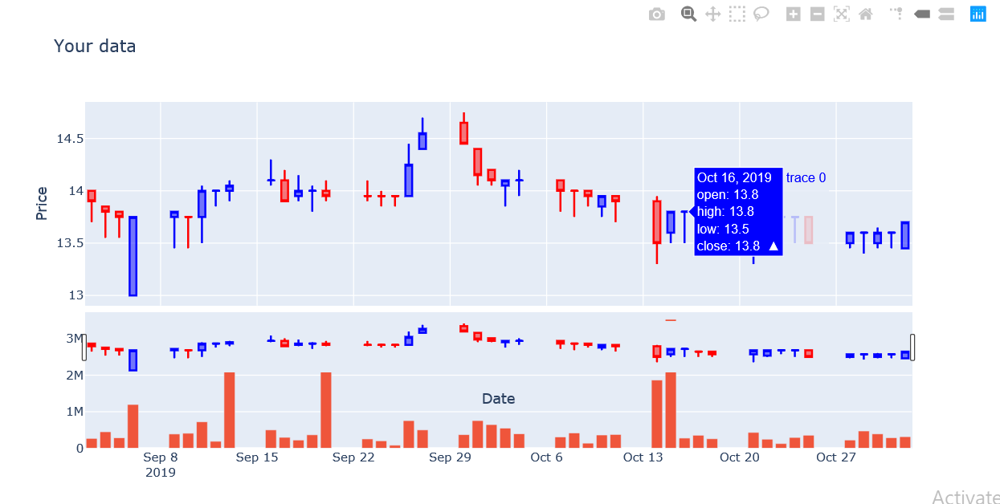

# vnquant package


## 1. Introduction
This project offers comprehensive financial information and advanced visualization tools for the Vietnam stock market to researchers. Specifically, it provides extensive data, including historical prices, finacial, business, and cashflow reports for individual or multiple symbols over the same period. This enables investors to conduct in-depth quantitative analyses and forecasting. Additionally, the available stock prices can be utilized to create visualizations with advanced metrics such as Bollinger Bands and Relative Strength Index (RSI), aiding in identifying optimal buying and selling points.

## 2. Setting:

### 2.1. Setup on local machine

This project is in developing process, So it is only distributed on github channel. To install requiring you open the command line and type the below commands:
```
git clone https://github.com/phamdinhkhanh/vnquant
cd vnquant
python setup.py install
```
you must install git command line in your computer to run above command.

### 2.2. Google colab

To use package in google colab, you have to mount point to google drive folder first and setup the same as in local machine. Reference to [google colab - vnquant example](https://drive.google.com/file/d/10KNNA4sZTk2dKW6wvv3tLMivgQDgd-5-/view?usp=sharing) for detail.

## 3. Visualization: (0.0.2)
from version 0.0.2 vnquant enable to you visualize stock price from any symbols code at source cafe or vnd or pandas data frame which have OHLC type. OHLC type meaning that your data frame columns is enough ['open', 'high', 'low', 'close'] list.
Below is general syntax of visualization function supported on vnquant package.

```{python}
import vnquant.plot as pl
pl.vnquant_candle_stick(data,
                        title=None,
                        xlab='Date', ylab='Price',
                        start_date=None, end_date=None,
                        colors=['blue', 'red'],
                        width=800, height=600,
                        show_advanced=[],
                        data_source='cafe',
                        **kargs)
```

**Arguments**
* `data`: is pandas data frame of OHLC type or OHLCV type, or string symbol of any VietNam stock index.
in case symbol, data is automatically cloned from open source.
* `title`: General title of candle stick chart. If data is a symbol, title is going to be created based on symbol and cloned datetime interval.
* `xlab`: x label. Default Date.
* `ylab`: y label. Default Price.
* `start_date`: start date. Default None. Must to be declared when data is symbol.
* `end_date`: end date. Default None. Must to be declared when data is symbol.
* `colors`: list colors defines increasing and decreasing color stick candle in order.
* `width`: with of plot frame. Default 800px
* `height`: height of plot frame. Default 600px
* `show_advanced`: list of advanced stock index to show up. Each element belongs to ['volume', 'macd', 'rsi'].
* `data_source`: invalid when use symbol intead of data frame. Source to clone data, 'VND' or 'CAFE'.

### 3.1. Visualization from source VND or CAFE

In this way, you can visualize stock price clone from VND or CAFE source by pass symbol, start_date, end_date into module as below:
```{python}
from vnquant import plot as plt
plt.vnquant_candle_stick(
    data='VND',
    title='VND symbol from 2019-09-01 to 2019-11-01',
    xlab='Date', ylab='Price',
    start_date='2019-09-01',
    end_date='2019-11-01',
    data_source='CAFE',
    show_advanced=['volume', 'macd', 'rsi'],
    width=1600,
    height=800
)
```


You can suppress volume by set up show_vol=False. Result as below:


### 3.2. Visualization from data frame
Data frame must be OHLC or OHLCV type. OHLC type when it includes ['open','high','low','close'] and OHLCV is ['open','high','low','close','volume'] or ['open','high','low','close','volume_match'] and index is DateTime. In case your data frame have columns with the same function, you should accordingly rename its.

```{python}
from vnquant import plot as plt

plt.vnquant_candle_stick(
    data = data,
    title='Your data',
    ylab='Date', xlab='Price',
    show_advanced=['volume', 'macd', 'rsi']
)
```



To check whether data_vnd frame is OHLC or OHLCV type you can try:

```{python}
from vnquant import utils
print(utils._isOHLC(data_vnd))
print(utils._isOHLCV(data_vnd))
```

Return `True` mean data frame is adapted types.

## 4. Clone Stock Prices: (0.1.2)
You can load the prices of one or more stocks in specific time interval according to syntax as below.
```{python}
import vnquant.data as dt

loader = dt.DataLoader(
  symbols: Union[str, list], 
  start: Optional[Union[str, datetime]]=None,
  end: Optional[Union[str, datetime]]=None, 
  data_source: str='CAFE', 
  minimal: bool=True,
  table_style: str='levels')
```

For example:

```
loader = DataLoader(
  symbols='VND', 
  start='2018-01-10', end='2018-02-15', 
  data_source='CAFE', 
  minimal=True, 
  table_style='levels')

loader.download()
```

**Arguments**
* `symbols` (Union[str, list]): A single stock symbol as a string or multiple stock symbols as a list of strings. The stock symbols regularly include 3 upper case letters except several special index such as: `E1VFVN30, FUEVN100` for both data_source `cafe and vnd`, `HNX-INDEX, HNX30-INDEX, UPCOM-INDEX` for `cafe`.
* `start` (Optional[Union[str, datetime]], default=None): The start date for the data. Can be a string in the format 'YYYY-MM-DD' or a datetime object.
* `end` (Optional[Union[str, datetime]], default=None): The end date for the data. Can be a string in the format 'YYYY-MM-DD' or a datetime object.
* `data_source` (str, default='CAFE'): The data source to be used for downloading stock data. Currently supports 'CAFE' and 'VND'.
* `minimal` (bool, default=True): If True, returns a minimal set of columns. If False, returns all available columns.
* `table_style` (str, default='levels'): The style of the returned table. Options are 'levels', 'prefix', and 'stack'.
- 'levels': Returns the DataFrame with multi-level colums of symbols and list of basic arguments like `['high', 'low', 'open', 'close', 'adjust', 'volume', 'value']`
- 'prefix': Adds the stock symbol as a prefix to each column name.
- 'stack': Returns the DataFrame and add one column 'code' to clarify each record belong to what stock symbol.

### 4.1. Clone one stock:

There are three return formats supported in the latest version 0.1.2.

- Multiple-level: It will return a table with mutilple column indexes with two main levels Arguments (including many basical stock indexes) and Symbols (including list of stock codes).

```{python}
import vnquant.data as dt
loader = dt.DataLoader('VND', '2018-02-02','2018-04-02')
data = loader.download()
data.head()
```
<table border="1" class="dataframe">
  <thead>
    <tr>
      <th>Attributes</th>
      <th>high</th>
      <th>low</th>
      <th>open</th>
      <th>close</th>
      <th>avg</th>
      <th>volume</th>
    </tr>
    <tr>
      <th>Symbols</th>
      <th>VND</th>
      <th>VND</th>
      <th>VND</th>
      <th>VND</th>
      <th>VND</th>
      <th>VND</th>
    </tr>
    <tr>
      <th>date</th>
      <th></th>
      <th></th>
      <th></th>
      <th></th>
      <th></th>
      <th></th>
    </tr>
  </thead>
  <tbody>
    <tr>
      <th>2018-02-02</th>
      <td>28.95</td>
      <td>27.60</td>
      <td>28.5</td>
      <td>28.95</td>
      <td>28.28</td>
      <td>1700670.0</td>
    </tr>
    <tr>
      <th>2018-02-05</th>
      <td>28.45</td>
      <td>26.95</td>
      <td>28.1</td>
      <td>26.95</td>
      <td>27.68</td>
      <td>2150120.0</td>
    </tr>
    <tr>
      <th>2018-02-06</th>
      <td>26.95</td>
      <td>25.10</td>
      <td>25.1</td>
      <td>26.40</td>
      <td>25.25</td>
      <td>3129690.0</td>
    </tr>
    <tr>
      <th>2018-02-07</th>
      <td>28.20</td>
      <td>27.50</td>
      <td>27.5</td>
      <td>28.20</td>
      <td>27.99</td>
      <td>1985120.0</td>
    </tr>
    <tr>
      <th>2018-02-08</th>
      <td>29.20</td>
      <td>27.70</td>
      <td>28.0</td>
      <td>28.00</td>
      <td>28.47</td>
      <td>943260.0</td>
    </tr>
  </tbody>
</table>

- Prefix: The stock code is appended before each index to become a column name.

```{python}
import vnquant.data as dt
loader = dt.DataLoader(['VND', 'FPT'], '2018-02-02','2018-04-02', table_style='prefix')
data = loader.download()
data.head()
```
<table border="1" class="dataframe">
  <thead>
    <tr style="text-align: right;">
      <th></th>
      <th>VND_code</th>
      <th>FPT_code</th>
      <th>VND_high</th>
      <th>FPT_high</th>
      <th>VND_low</th>
      <th>FPT_low</th>
      <th>VND_open</th>
      <th>FPT_open</th>
      <th>VND_close</th>
      <th>FPT_close</th>
      <th>VND_adjust</th>
      <th>FPT_adjust</th>
      <th>VND_volume_match</th>
      <th>FPT_volume_match</th>
      <th>VND_value_match</th>
      <th>FPT_value_match</th>
    </tr>
    <tr>
      <th>date</th>
      <th></th>
      <th></th>
      <th></th>
      <th></th>
      <th></th>
      <th></th>
      <th></th>
      <th></th>
      <th></th>
      <th></th>
      <th></th>
      <th></th>
      <th></th>
      <th></th>
      <th></th>
      <th></th>
    </tr>
  </thead>
  <tbody>
    <tr>
      <th>2018-04-02</th>
      <td>VND</td>
      <td>FPT</td>
      <td>29.80</td>
      <td>61.7</td>
      <td>29.10</td>
      <td>61.0</td>
      <td>29.10</td>
      <td>61.5</td>
      <td>29.55</td>
      <td>61.5</td>
      <td>6.52</td>
      <td>21.98</td>
      <td>2141980.0</td>
      <td>2194820.0</td>
      <td>6.320100e+10</td>
      <td>1.347410e+11</td>
    </tr>
    <tr>
      <th>2018-03-30</th>
      <td>VND</td>
      <td>FPT</td>
      <td>29.50</td>
      <td>61.3</td>
      <td>28.75</td>
      <td>59.4</td>
      <td>29.00</td>
      <td>59.6</td>
      <td>29.05</td>
      <td>60.7</td>
      <td>6.41</td>
      <td>21.69</td>
      <td>1688000.0</td>
      <td>2434830.0</td>
      <td>4.925300e+10</td>
      <td>1.474940e+11</td>
    </tr>
    <tr>
      <th>2018-03-29</th>
      <td>VND</td>
      <td>FPT</td>
      <td>29.00</td>
      <td>59.7</td>
      <td>28.25</td>
      <td>59.0</td>
      <td>28.50</td>
      <td>59.4</td>
      <td>29.00</td>
      <td>59.5</td>
      <td>6.40</td>
      <td>21.26</td>
      <td>1294580.0</td>
      <td>827280.0</td>
      <td>3.717900e+10</td>
      <td>4.915900e+10</td>
    </tr>
    <tr>
      <th>2018-03-28</th>
      <td>VND</td>
      <td>FPT</td>
      <td>28.65</td>
      <td>59.4</td>
      <td>27.60</td>
      <td>58.8</td>
      <td>27.75</td>
      <td>59.1</td>
      <td>28.65</td>
      <td>58.9</td>
      <td>6.32</td>
      <td>21.05</td>
      <td>1429910.0</td>
      <td>660440.0</td>
      <td>4.012300e+10</td>
      <td>3.901500e+10</td>
    </tr>
    <tr>
      <th>2018-03-27</th>
      <td>VND</td>
      <td>FPT</td>
      <td>28.55</td>
      <td>60.1</td>
      <td>27.75</td>
      <td>59.0</td>
      <td>28.55</td>
      <td>59.9</td>
      <td>28.00</td>
      <td>59.5</td>
      <td>6.18</td>
      <td>21.26</td>
      <td>2589800.0</td>
      <td>993260.0</td>
      <td>7.289400e+10</td>
      <td>5.916600e+10</td>
    </tr>
  </tbody>
</table>

- Stack: It will add one more column named code to demonstrate the stock symbols.

```{python}
import vnquant.data as dt
loader = dt.DataLoader(['VND', 'FPT'], '2018-02-02','2018-04-02', table_style='stack')
data = loader.download()
data.head(4)
```
<table border="1" class="dataframe">
  <thead>
    <tr style="text-align: right;">
      <th></th>
      <th>code</th>
      <th>high</th>
      <th>low</th>
      <th>open</th>
      <th>close</th>
      <th>adjust</th>
      <th>volume_match</th>
      <th>value_match</th>
    </tr>
    <tr>
      <th>date</th>
      <th></th>
      <th></th>
      <th></th>
      <th></th>
      <th></th>
      <th></th>
      <th></th>
      <th></th>
    </tr>
  </thead>
  <tbody>
    <tr>
      <th>2018-04-02</th>
      <td>FPT</td>
      <td>61.7</td>
      <td>61.00</td>
      <td>61.5</td>
      <td>61.50</td>
      <td>21.98</td>
      <td>2194820.0</td>
      <td>1.347410e+11</td>
    </tr>
    <tr>
      <th>2018-04-02</th>
      <td>VND</td>
      <td>29.8</td>
      <td>29.10</td>
      <td>29.1</td>
      <td>29.55</td>
      <td>6.52</td>
      <td>2141980.0</td>
      <td>6.320100e+10</td>
    </tr>
    <tr>
      <th>2018-03-30</th>
      <td>FPT</td>
      <td>61.3</td>
      <td>59.40</td>
      <td>59.6</td>
      <td>60.70</td>
      <td>21.69</td>
      <td>2434830.0</td>
      <td>1.474940e+11</td>
    </tr>
    <tr>
      <th>2018-03-30</th>
      <td>VND</td>
      <td>29.5</td>
      <td>28.75</td>
      <td>29.0</td>
      <td>29.05</td>
      <td>6.41</td>
      <td>1688000.0</td>
      <td>4.925300e+10</td>
    </tr>
  </tbody>
</table>

### 4.2. Clone more stocks

We need to set up symbols as a list.
```{python}
loader = dt.DataLoader(symbols=["VND", "VCB"], start="2018-01-10", end="2018-02-15", minimal=True, data_source="cafe")
data = loader.download()
data.head()
```
<table border="1" class="dataframe">
  <thead>
    <tr>
      <th>Attributes</th>
      <th colspan="2" halign="left">high</th>
      <th colspan="2" halign="left">low</th>
      <th colspan="2" halign="left">open</th>
      <th colspan="2" halign="left">close</th>
      <th colspan="2" halign="left">avg</th>
      <th colspan="2" halign="left">volume</th>
    </tr>
    <tr>
      <th>Symbols</th>
      <th>VND</th>
      <th>VCB</th>
      <th>VND</th>
      <th>VCB</th>
      <th>VND</th>
      <th>VCB</th>
      <th>VND</th>
      <th>VCB</th>
      <th>VND</th>
      <th>VCB</th>
      <th>VND</th>
      <th>VCB</th>
    </tr>
    <tr>
      <th>date</th>
      <th></th>
      <th></th>
      <th></th>
      <th></th>
      <th></th>
      <th></th>
      <th></th>
      <th></th>
      <th></th>
      <th></th>
      <th></th>
      <th></th>
    </tr>
  </thead>
  <tbody>
    <tr>
      <th>2018-01-10</th>
      <td>27.75</td>
      <td>59.2</td>
      <td>27.10</td>
      <td>57.3</td>
      <td>27.55</td>
      <td>58.3</td>
      <td>27.50</td>
      <td>58.0</td>
      <td>27.52</td>
      <td>58.08</td>
      <td>1466780.0</td>
      <td>2842830.0</td>
    </tr>
    <tr>
      <th>2018-01-11</th>
      <td>27.50</td>
      <td>58.8</td>
      <td>26.80</td>
      <td>57.2</td>
      <td>27.30</td>
      <td>57.5</td>
      <td>27.20</td>
      <td>58.8</td>
      <td>27.21</td>
      <td>58.04</td>
      <td>1260720.0</td>
      <td>1766240.0</td>
    </tr>
    <tr>
      <th>2018-01-12</th>
      <td>28.20</td>
      <td>59.4</td>
      <td>27.35</td>
      <td>58.0</td>
      <td>27.45</td>
      <td>58.8</td>
      <td>27.60</td>
      <td>58.0</td>
      <td>27.76</td>
      <td>58.63</td>
      <td>1730170.0</td>
      <td>2525840.0</td>
    </tr>
    <tr>
      <th>2018-01-15</th>
      <td>28.40</td>
      <td>60.0</td>
      <td>27.35</td>
      <td>57.0</td>
      <td>27.60</td>
      <td>58.0</td>
      <td>28.25</td>
      <td>60.0</td>
      <td>28.11</td>
      <td>58.76</td>
      <td>1273740.0</td>
      <td>2217420.0</td>
    </tr>
    <tr>
      <th>2018-01-16</th>
      <td>28.40</td>
      <td>60.3</td>
      <td>27.90</td>
      <td>58.8</td>
      <td>28.10</td>
      <td>59.3</td>
      <td>28.25</td>
      <td>60.0</td>
      <td>28.14</td>
      <td>59.64</td>
      <td>1163350.0</td>
      <td>2218380.0</td>
    </tr>
  </tbody>
</table>

### 4.3. Clone full information:
To get more the others information about `volume` and `value` beside basical fields, we need to declare `minimal=False` (default `True`).
```{python}
loader = dt.DataLoader(symbols=["VND"], start="2018-01-10", end="2018-02-15", minimal=False)
data = loader.download()
data.head()
```
<table border="1" class="dataframe">
  <thead>
    <tr>
      <th>Attributes</th>
      <th>change_perc1</th>
      <th>change_perc2</th>
      <th>open</th>
      <th>high</th>
      <th>low</th>
      <th>close</th>
      <th>avg</th>
      <th>volume_match</th>
      <th>volume_reconcile</th>
      <th>volume</th>
    </tr>
    <tr>
      <th>Symbols</th>
      <th>VND</th>
      <th>VND</th>
      <th>VND</th>
      <th>VND</th>
      <th>VND</th>
      <th>VND</th>
      <th>VND</th>
      <th>VND</th>
      <th>VND</th>
      <th>VND</th>
    </tr>
    <tr>
      <th>date</th>
      <th></th>
      <th></th>
      <th></th>
      <th></th>
      <th></th>
      <th></th>
      <th></th>
      <th></th>
      <th></th>
      <th></th>
    </tr>
  </thead>
  <tbody>
    <tr>
      <th>2018-01-10</th>
      <td>0.00</td>
      <td>0.000000</td>
      <td>27.55</td>
      <td>27.75</td>
      <td>27.10</td>
      <td>27.50</td>
      <td>27.52</td>
      <td>1382780.0</td>
      <td>84000.0</td>
      <td>1466780.0</td>
    </tr>
    <tr>
      <th>2018-01-11</th>
      <td>-0.30</td>
      <td>0.010909</td>
      <td>27.30</td>
      <td>27.50</td>
      <td>26.80</td>
      <td>27.20</td>
      <td>27.21</td>
      <td>1260720.0</td>
      <td>0.0</td>
      <td>1260720.0</td>
    </tr>
    <tr>
      <th>2018-01-12</th>
      <td>0.40</td>
      <td>0.014706</td>
      <td>27.45</td>
      <td>28.20</td>
      <td>27.35</td>
      <td>27.60</td>
      <td>27.76</td>
      <td>1730170.0</td>
      <td>0.0</td>
      <td>1730170.0</td>
    </tr>
    <tr>
      <th>2018-01-15</th>
      <td>0.65</td>
      <td>0.023551</td>
      <td>27.60</td>
      <td>28.40</td>
      <td>27.35</td>
      <td>28.25</td>
      <td>28.11</td>
      <td>1273740.0</td>
      <td>0.0</td>
      <td>1273740.0</td>
    </tr>
    <tr>
      <th>2018-01-16</th>
      <td>0.00</td>
      <td>0.000000</td>
      <td>28.10</td>
      <td>28.40</td>
      <td>27.90</td>
      <td>28.25</td>
      <td>28.14</td>
      <td>1077350.0</td>
      <td>86000.0</td>
      <td>1163350.0</td>
    </tr>
  </tbody>
</table>

Through this project, i hope you make your work being more covinient and easy by applying them. Though try hard, but there are many drawback,
kindly comment and send me feed back to implement my project.

# 5. Get finance, cashflow, business and basic index reports (0.0.3)

In version 0.0.3 you can download finance, cashflow, business and basic index reports with class `vnquant.data.FinanceLoader`. Currently, we only support you clone one symbol per each time. To use this class you import as bellow:

```
import vnquant.data as dt
loader = dt.FinanceLoader(symbol = 'VND', 
                          start = '2019-06-02',
                          end = '2021-12-31')
```

**Arguments**
* `symbol`: a string indicates the stock name. The stock symbol in regular includes 3 upper case letters.
* `start`: start date time with format `yyyy-mm-dd`.
* `end`: end date time with format `yyyy-mm-dd`.

## 5.1. Get finance report

Function `get_finan_report()` will help you get these finance indexes. For example:

```
import vnquant.data as dt
loader = dt.FinanceLoader('VND', '2019-06-02','2021-12-31')
data_finan = loader.get_finan_report()
data_finan.head()
```
<table border="1" class="dataframe">
  <thead>
    <tr style="text-align: right;">
      <th></th>
      <th>2021-06</th>
      <th>2021-03</th>
      <th>2020-12</th>
      <th>2020-09</th>
      <th>2020-06</th>
      <th>2020-03</th>
      <th>2019-12</th>
      <th>2019-09</th>
      <th>2019-06</th>
    </tr>
    <tr>
      <th>index</th>
      <th></th>
      <th></th>
      <th></th>
      <th></th>
      <th></th>
      <th></th>
      <th></th>
      <th></th>
      <th></th>
    </tr>
  </thead>
  <tbody>
    <tr>
      <th>Tài sản ngắn hạn</th>
      <td>21351441834807</td>
      <td>17347112129802</td>
      <td>12793253609747</td>
      <td>11585099253268</td>
      <td>11479005695043</td>
      <td>10851511570130</td>
      <td>11239350733660</td>
      <td>11059560981795</td>
      <td>10590145635691</td>
    </tr>
    <tr>
      <th>Tài sản tài chính ngắn hạn</th>
      <td>21339567743512</td>
      <td>17332349291032</td>
      <td>12770938291296</td>
      <td>11570420145910</td>
      <td>11465268994352</td>
      <td>10826493556341</td>
      <td>11222476803929</td>
      <td>11036102039564</td>
      <td>10550582164047</td>
    </tr>
    <tr>
      <th>Tiền và các khoản tương đương tiền</th>
      <td>1153684350307</td>
      <td>590663521250</td>
      <td>595786368281</td>
      <td>175314778804</td>
      <td>185532378242</td>
      <td>368330609085</td>
      <td>613548205346</td>
      <td>298144380199</td>
      <td>413837038988</td>
    </tr>
    <tr>
      <th>Tiền</th>
      <td>778884350307</td>
      <td>460708745512</td>
      <td>509970753138</td>
      <td>141314778804</td>
      <td>148847077857</td>
      <td>346330609085</td>
      <td>611548205346</td>
      <td>158744380199</td>
      <td>252137038988</td>
    </tr>
    <tr>
      <th>Tiền gửi của người đầu tư về giao dịch chứng khoán</th>
      <td>0</td>
      <td>0</td>
      <td>0</td>
      <td>0</td>
      <td>0</td>
      <td>0</td>
      <td>0</td>
      <td>0</td>
      <td>0</td>
    </tr>
  </tbody>
</table>

## 5.2. Get business report

To get business report of each symbol, you use `get_business_report()` function as below:

```
import vnquant.data as dt
loader = dt.FinanceLoader('VND', '2019-06-02','2021-12-31', data_source='VND', minimal=True)
data_bus = loader.get_business_report()
data_bus.head()
```

<table border="1" class="dataframe">
  <thead>
    <tr style="text-align: right;">
      <th></th>
      <th>2021-06</th>
      <th>2021-03</th>
      <th>2020-12</th>
      <th>2020-09</th>
      <th>2020-06</th>
      <th>2020-03</th>
      <th>2019-12</th>
      <th>2019-09</th>
      <th>2019-06</th>
    </tr>
    <tr>
      <th>index</th>
      <th></th>
      <th></th>
      <th></th>
      <th></th>
      <th></th>
      <th></th>
      <th></th>
      <th></th>
      <th></th>
    </tr>
  </thead>
  <tbody>
    <tr>
      <th>Lãi từ các tài sản tài chính ghi nhận thông qua lãi/lỗ ( FVTPL)</th>
      <td>384484114460</td>
      <td>446903481873</td>
      <td>348445083732</td>
      <td>177846582328</td>
      <td>126873424297</td>
      <td>112699410946</td>
      <td>69471930133</td>
      <td>100788177914</td>
      <td>96112568053</td>
    </tr>
    <tr>
      <th>Lãi bán các tài sản tài chính PVTPL</th>
      <td>187329856826</td>
      <td>258061271830</td>
      <td>321502700913</td>
      <td>126020773731</td>
      <td>120870780627</td>
      <td>121996865833</td>
      <td>77348559746</td>
      <td>70332267851</td>
      <td>62535937574</td>
    </tr>
    <tr>
      <th>Chênh lệch tăng đánh giá lại các TSTC thông qua lãi/lỗ</th>
      <td>192578271638</td>
      <td>188425144043</td>
      <td>-8160509655</td>
      <td>33713693597</td>
      <td>-848309517</td>
      <td>-10832424389</td>
      <td>-13633761575</td>
      <td>28457177453</td>
      <td>15139720013</td>
    </tr>
    <tr>
      <th>Cổ tức, tiền lãi phát sinh từ tài sản tài chính PVTPL</th>
      <td>4575985996</td>
      <td>417066000</td>
      <td>35102892474</td>
      <td>18112115000</td>
      <td>6850953187</td>
      <td>1534969502</td>
      <td>5757131962</td>
      <td>1998732610</td>
      <td>18436910466</td>
    </tr>
    <tr>
      <th>Lãi từ các khoản đầu tư nắm giữ đến ngày đáo hạn</th>
      <td>24948288940</td>
      <td>108779296202</td>
      <td>98753552528</td>
      <td>84000482631</td>
      <td>84108399683</td>
      <td>105941161289</td>
      <td>107029644615</td>
      <td>100310037665</td>
      <td>120061106620</td>
    </tr>
  </tbody>
</table>


## 5.3. Get cashflow report

Function `get_cashflow_report()` shall support to clone cashflow report:

```
import vnquant.data as dt
loader = dt.FinanceLoader('VND', '2019-06-02','2021-12-31', data_source='VND', minimal=True)
data_cash = loader.get_cashflow_report()
data_cash.head()
```

<table border="1" class="dataframe">
  <thead>
    <tr style="text-align: right;">
      <th></th>
      <th>2021-06</th>
      <th>2021-03</th>
      <th>2020-09</th>
      <th>2020-06</th>
      <th>2020-03</th>
      <th>2019-12</th>
      <th>2019-09</th>
      <th>2019-06</th>
    </tr>
    <tr>
      <th>index</th>
      <th></th>
      <th></th>
      <th></th>
      <th></th>
      <th></th>
      <th></th>
      <th></th>
      <th></th>
    </tr>
  </thead>
  <tbody>
    <tr>
      <th>Điều chỉnh cho các khoản</th>
      <td>117772457799</td>
      <td>102102918502</td>
      <td>39938806717</td>
      <td>-2179656198</td>
      <td>189614451308</td>
      <td>77119446501</td>
      <td>115901816119</td>
      <td>310400347299</td>
    </tr>
    <tr>
      <th>Chi phí khấu hao tài sản cố định</th>
      <td>7121178573</td>
      <td>5117724702</td>
      <td>5200320730</td>
      <td>4817922370</td>
      <td>5082314726</td>
      <td>4956658731</td>
      <td>5024428635</td>
      <td>5218835903</td>
    </tr>
    <tr>
      <th>Phân bổ lợi thế thương mại</th>
      <td>0</td>
      <td>0</td>
      <td>0</td>
      <td>0</td>
      <td>0</td>
      <td>0</td>
      <td>0</td>
      <td>0</td>
    </tr>
    <tr>
      <th>Dự phòng giảm giá các khoản đầu tư ngắn hạn, dài hạn</th>
      <td>15351994938</td>
      <td>7673582615</td>
      <td>-50406427024</td>
      <td>-97302010585</td>
      <td>74769599906</td>
      <td>-47666085953</td>
      <td>-1958363587</td>
      <td>194803059759</td>
    </tr>
    <tr>
      <th>Lãi, lỗ chênh lệch tỷ giá hối đoái chưa thực hiện</th>
      <td>2291430861</td>
      <td>0</td>
      <td>-855383375</td>
      <td>-855383375</td>
      <td>0</td>
      <td>-535741671</td>
      <td>-136318575</td>
      <td>136318575</td>
    </tr>
  </tbody>
</table>

## 5.4. Get basic index report

This function provide to you basic and important index of each symbol such as: `ROA, ROE, Net Profit Marget, Net Revenue Growth, Profit After tax Growth`

```
import vnquant.data as dt
loader = dt.FinanceLoader('VND', '2019-06-02','2021-12-31', data_source='VND', minimal=True)
data_basic = loader.get_basic_index()
data_basic.head()
```
<table border="1" class="dataframe">
  <thead>
    <tr style="text-align: right;">
      <th></th>
      <th>2020-12</th>
      <th>2019-12</th>
    </tr>
    <tr>
      <th>index</th>
      <th></th>
      <th></th>
    </tr>
  </thead>
  <tbody>
    <tr>
      <th>Profit After Tax Growth (YoY)</th>
      <td>0.810405</td>
      <td>0.025519</td>
    </tr>
    <tr>
      <th>Net Revenue Growth (YoY)</th>
      <td>0.421240</td>
      <td>-0.023797</td>
    </tr>
    <tr>
      <th>Net Profit Margin (Yr)</th>
      <td>0.324553</td>
      <td>0.254787</td>
    </tr>
    <tr>
      <th>ROE last 4 quarters</th>
      <td>0.195974</td>
      <td>0.123374</td>
    </tr>
    <tr>
      <th>ROA last 4 quarters</th>
      <td>0.053917</td>
      <td>0.033224</td>
    </tr>
  </tbody>
</table>

# Stars stats

<p align="center">
<a href="https://star-history.com/#phamdinhkhanh/vnquant">
  <picture>
    <source media="(prefers-color-scheme: dark)" srcset="https://api.star-history.com/svg?repos=phamdinhkhanh/vnquant&type=Date&theme=dark" />
    <source media="(prefers-color-scheme: light)" srcset="https://api.star-history.com/svg?repos=phamdinhkhanh/vnquant&type=Date" />
    
  </picture>
</a>
</p>
